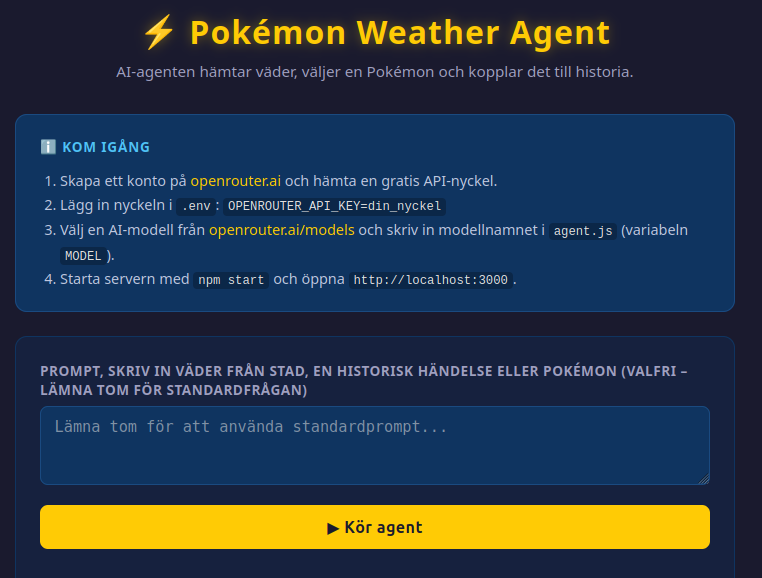

# Pokemon Weather Agent
En enkel AI-agent som använder MCP för att hämta väder, välja en Pokemon och koppla resultatet till en historisk händelse. Projektet byggdes som övning inför mitt examensarbete, där jag också arbetar med att utveckla AI-agenter.


## Kom igang
1. Skapa ett konto pa [openrouter.ai](https://openrouter.ai) och hamta en API-nyckel.
2. Lagg in nyckeln i `.env`:

	```env
	OPENROUTER_API_KEY=din_nyckel
	```

3. Valj en modell fran [openrouter.ai/models](https://openrouter.ai/models) och skriv in modellnamnet i `agent.js` i konstanten `MODEL`.
4. Installera beroenden och starta projektet:

	```bash
	npm install
	npm start
	```

5. Öppna `http://localhost:3000`.

## UI


